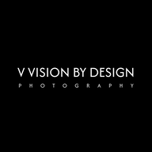

  <a href="https://vvisionbydesign.netlify.app">
    
    <h1 align="center">V Vision by Design</h1>
  </a>

> Website for V Vision by Design Photography

A static site using:

- [eleventy](https://www.11ty.dev/)
- [liquid](https://shopify.github.io/liquid/)
- [tailwindcss](https://tailwindcss.com/)

# Todo

- [ ] Sync Proton Drive locally with [rclone](https://rclone.org/protondrive/)
- [ ] Optimize a few oversized images
- [ ] Implement `srcset` with `sizes`
- [ ] Better web app icon
- [ ] Individual photo pages
